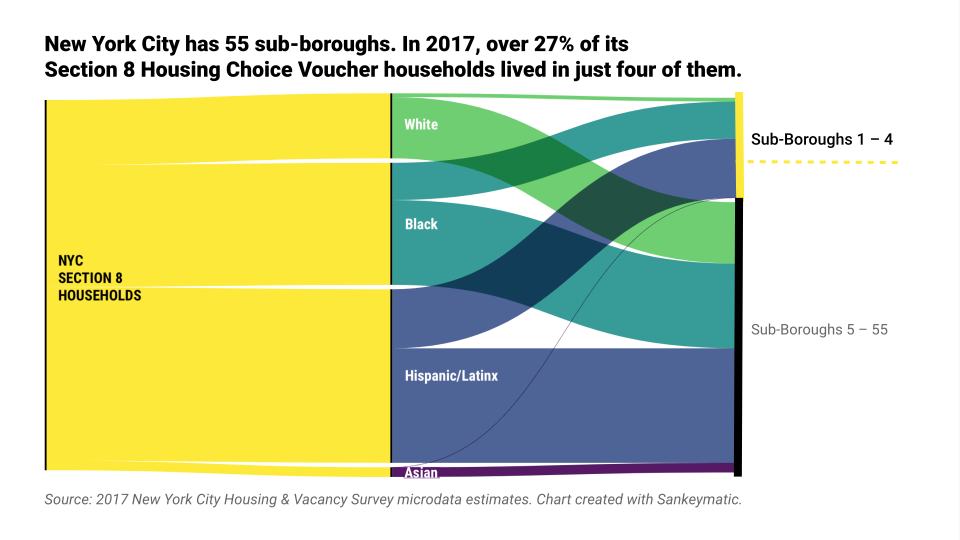
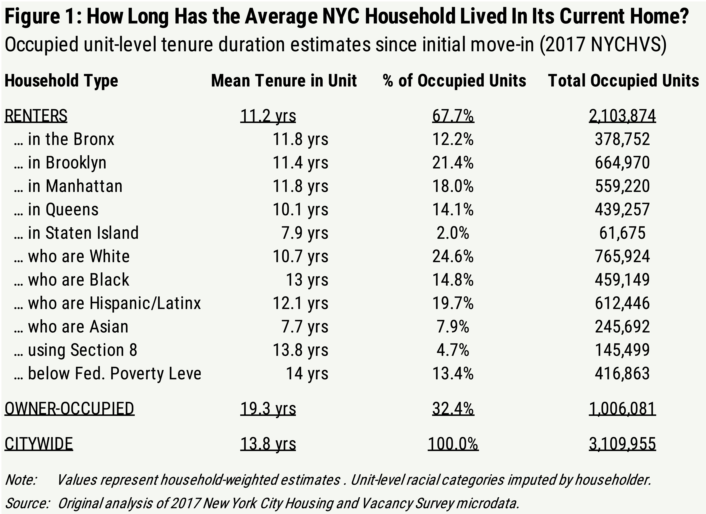
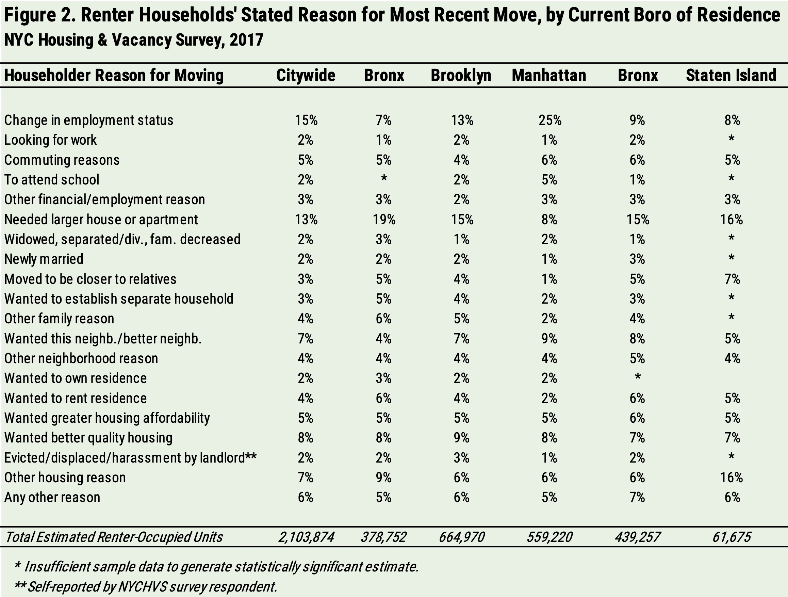
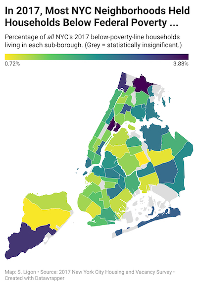
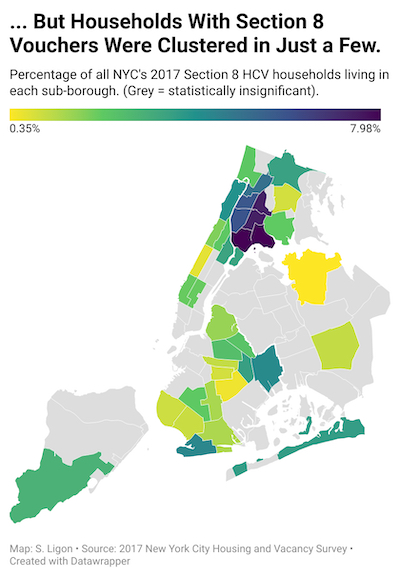
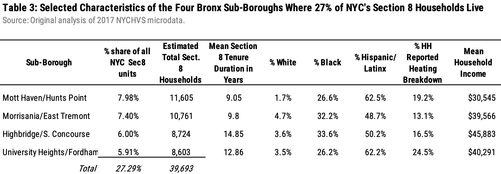
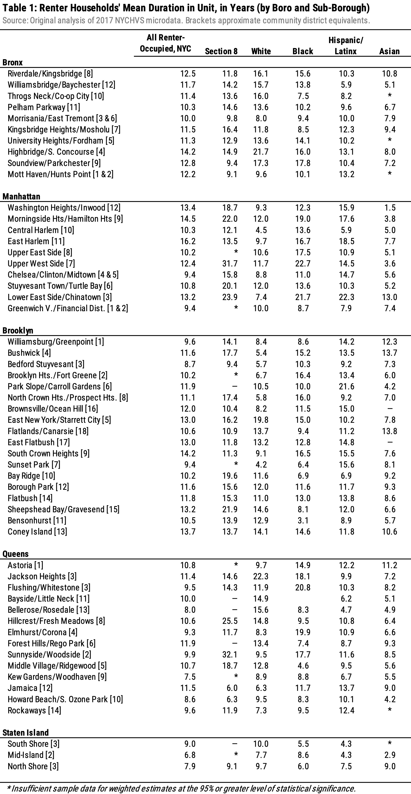
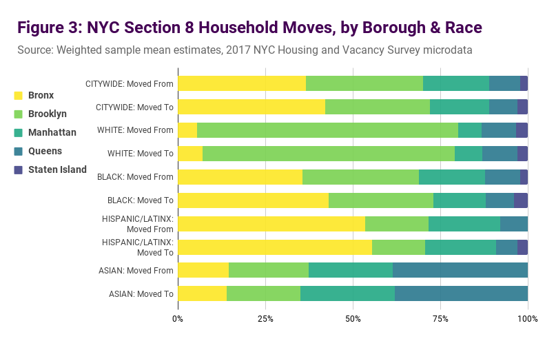
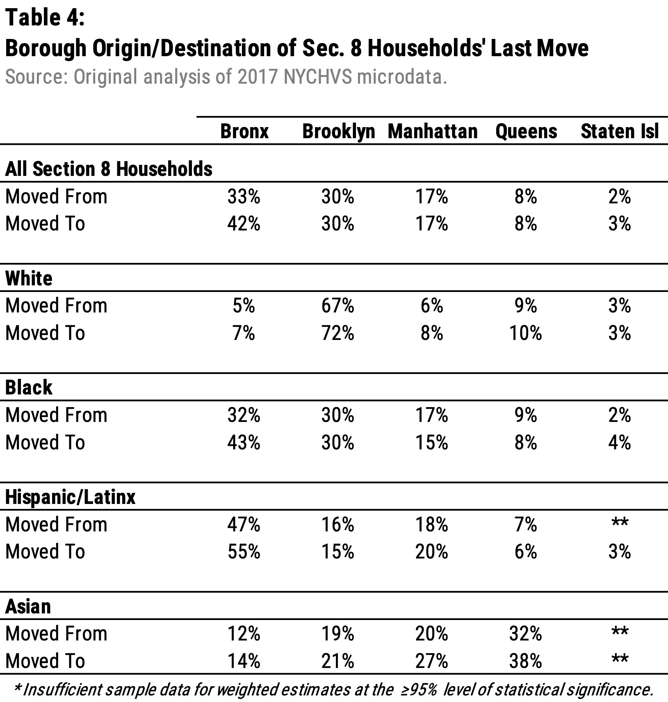
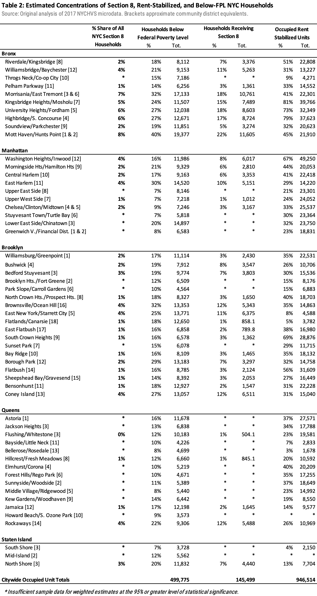

How Mobile Are NYC’s Housing Choice Voucher Users? An Analysis of the
2017 NYCHVS
================

- <a href="#data--code-structure" id="toc-data--code-structure">Data &amp;
  Code Structure</a>
- <a href="#key-findings" id="toc-key-findings">Key Findings</a>
  - <a href="#why-new-yorkers-move" id="toc-why-new-yorkers-move">Why New
    Yorkers Move</a>
  - <a href="#where-displaced-or-priced-out-new-yorkers-move"
    id="toc-where-displaced-or-priced-out-new-yorkers-move">Where Displaced
    or Priced-Out New Yorkers Move</a>
  - <a href="#mobility-racial-inequity--nycs-mobility-voucher-program"
    id="toc-mobility-racial-inequity--nycs-mobility-voucher-program">Mobility,
    Racial Inequity, &amp; NYC’s Mobility Voucher Program</a>

Sarah Ligon ([@ligonish](https://github.com/ligonish))  
November 2021

<center>

</center>

In September 2021, I joined a team of two other graduate researchers
assessing NYC’s
[newly-federally-funded](https://www.hud.gov/program_offices/public_indian_housing/programs/hcv/mobilitydemo)
Housing Mobility
[Demonstration](https://www.nyc.gov/site/hpd/services-and-information/community-choice.page)
for the NYU School of Law and School of Public Policy’s joint seminar on
“Land Use, Housing, & Community Development in New York City”. The code,
analysis, and visualizations in this repository are my own original
contributions to the data section of what grew to a 56-page
collaborative paper.

I was skeptical of housing mobility initiatives’ ability to deliver
racially equitable housing choice to contemporary New Yorkers, and only
grew more so while exploring the data below. The [“root
shock”](https://nyupress.org/9781613320198/root-shock/) and loss of
community networks often experienced by Black and brown mobility program
participants is well-documented, from early voucher recipients such as
Chicago’s
[Gautreaux](https://www.researchgate.net/publication/237120860_The_Role_of_Social_Networks_in_Making_Housing_Choices_The_Experience_of_the_Gautreaux_Two_Residential_Mobility_Program)
to the trauma of mass displacement over decades of New York officials’
policies of urban “renewal”. NYC landlords rampantly discriminate
against voucherholders of color: in the spring of 2021 — just as NYC was
receiving its millions of dollars in federal funding for more Section 8
Housing Choice Vouchers as part of the demonstration my team would
evaluate — New York’s Fair Housing Initiative filed a [lawsuit against
88 NYC landlords and
brokers](https://www.nytimes.com/2021/03/15/nyregion/real-estate-lawsuit-section-8-discrimination.html),
alleging sweeping patterns of illegal voucher discrimination.

The analysis below, then, asks the 2017 NYCHVS to tell us about mobility
patterns not just of New Yorkers in general, but those of color in
particular. I also concentrated on what the NYCHVS could reveal about
New Yorkers who already receive mobility-focused City housing assistance
in the form of Section 8 HCV users, since that’s what the newly-funded
Demonstration would expand. As indicated in the charts and figures
below, patterns in the NYCHVS indicate Black, Latinx, and HCV-holder
households experience very different access to housing mobility than the
rest of the city.

My thanks to NYU Law teammates Eliza Ezrapour and Justin Cook for their
brilliance and great good humor during what was, by any standards, an
eerie semester.

## Data & Code Structure

Residential mobility is infamously difficult to quantify:
publicly-available datasets allow very limited tracking of voluntary and
(especially) involuntary household moves, with significant sampling
challenges, standard errors, and tracking lags baked in.

For this project, my primary source of large-scale NYC housing mobility
data was the U.S. Census Bureau’s [“New York City Housing and Vacancy
Survey: 2017 Data
Files”](https://www.census.gov/data/datasets/2017/demo/nychvs/microdata.html),
accessed 20 October 2021 and analyzed in Stata.

- See *data_raw* repository folder for original microdata records of
  household-level vacant, household-level-occupied, and person-level
  NYCHVS 2017 survey estimates.
- See *documentation* repository folder for NYCHVS codebooks, data
  dictionaries (including [Sub-Borough Maps &
  Codes](https://www.census.gov/geographies/reference-maps/2017/demo/nychvs/sub-bourough-maps.html)),
  and official *Guide to Estimating Variances*.

Pre-analysis setup workflow as documented in this repository’s Stata .do
files:

1.  Download the three original occupied & vacant NYCHVS microdata files
2.  Make a fourth by appending vacant to occupied housing records (for
    housing unit estimates)
3.  Merge PUMA names for future spatial analysis with IPUMS microdata
4.  Convert final and replicate weights (in raw form they have five
    implied decimal places, so divide by 100k)

``` stata
replace fw = fw/100000
foreach x of var fw1 - fw80 {
    replace `x' = `x' / 100000
    }   
```

5.  Set survey design parameters for accurate weighted estimates. I used
    Stata’s -svset- function, but you can also use R’s *survey* package
    or similar. See this UCLA
    [tutorial](stats.idre.ucla.edu/stata/seminars/survey-data-analysis-in-stata-17)
    on working with sampling weights in Stata.

``` stata
svyset[pweight = fw], vce(sdr) sdrweight(fw1-fw80) fay(.5)mse
```

The *stata_do_files* repository folder holds replicable code to produce
the Stata graphs and tabular data .csv exports I then formatted in
Google Sheets and/or Datawrapper below. (Current Me would use R for the
whole process, but 2021 Me was making myself learn Stata for a separate
Wagner project.)

## Key Findings

At first glance, New York owners and renters may seem unexpectedly
static: while high-income Manhattanites’ headline-grabbing COVID-era
relocations become something of a national curiosity in the year leading
up to this project, NYC residents tend to live in the same units for
unusually long periods of time. The most recently-available nationwide
American Housing Survey (AHS), taken in 2017, places [U.S. homeowners in
their current residences for an average of 16 years, and renters for
4.5](https://www.jchs.harvard.edu/sites/default/files/harvard_jchs_are_americans_stuck_in_place_frost_2020.pdf).
In the same year, the 2017 NYCHVS suggested the average NYC owner has
lived in the same house for 19.3 years, and the mean New York City
renter household has lived in their current unit for 11.8 years — almost
*three times* the national average for other American renters.

<center>

</center>

As indicated in Figure 1, there is little variance from this 11 to 12
year renter mean at the between-borough level, with the exception of
Staten Island’s 7.9 year average rental duration (though, at 65.5%
owner-occupied units, Staten Island is also the only borough where
renters constitute the minority). At the between-household and
between-district level, however, crucial differences in New York City
renters’ degrees of mobility emerge.

Renters using Section 8 mobility vouchers are significantly *more*
static than non-Section 8 renters across the city. Averaging 13.8 years,
Section 8 voucher holders’ rental tenure is also close to that of Black
New Yorkers (13 years), and almost as long as the 14-year average tenure
of renter households below 100% of the federal poverty limit for their
household size. White renters, on the other hand, spend a
shorter-than-average number of years in their units, suggesting they
move more often.

### Why New Yorkers Move

The NYCHVS asks heads of households when their household moved to their
current unit, why they moved to their unit, and the name of the borough
where they previously lived.

<center>

</center>

The most commonly-stated explanation among renters across the city was
change in employment status (15%), followed by need for a larger
dwelling unit (13%). In each borough, 5 to 6 percent of renter
households said they moved to their current location in search of
greater housing affordability, while 1 to 3 percent reported moving due
to eviction, displacement, or harassment by a landlord.

### Where Displaced or Priced-Out New Yorkers Move

There’s insufficient data at the sub-borough level to produce accurate
weighted estimates of post-eviction/ displacement/harassment moves to
all 55 New York City sub-boroughs. Sampled NYCHVS survey respondents who
reported moving for this reason were, however, sufficiently clustered
within just two neighborhoods to indicate — at the 95% level of
statistical significance — that 8.8% of self-reported evicted/harassed
tenants moved to units in the Morrisania/East Tremont sub-borough of the
Bronx (which approximately encompasses Community Districts 203 and 206),
and 4.4% to Washington Heights/Inwood (Community District 112).

Households also tended to cite a need for greater affordability fairly
evenly across boroughs — an unsurprising fact given both the general
phrasing of the survey question and the broad spread of households below
federal poverty limits in virtually every neighborhood of New York City.

### Mobility, Racial Inequity, & NYC’s Mobility Voucher Program

A group that *does*, however, appear to experience moving patterns more
restricted than the rest of New York City’s is the one meant to have the
broadest range of housing choice: Section 8 Housing Choice Voucher (HCV)
holders, over 27% of whom are clustered in just four sub-boroughs in the
Bronx.

<center>
 
</center>

These four sub-boroughs, where 27.29% of all NYC’s Section 8 HCV
recipients could use their vouchers, are predominantly Black and brown.
Resident HCV users reported high levels of heating breakdown and other
maintenance failure by landlords.

<center>

</center>

NYCHVS’s estimated 145,499 Section 8 voucher holder households appear
unusually static when taken as a whole (see Figure 1 above). But
HCV-holder households of different races experience very different
levels of housing stability.

<center>

</center>

Black householders — who overall average the lengthiest unit stays
citywide (15.3 years) when compared to other New York householders of
all other races — experience the *shortest* duration in Section 8 units
in relation to all other HCV users (see Fig. 3).

<center>

</center>

These discrepancies also extend to Section 8 voucher holders’ moving
patterns across boroughs and sub-boroughs: 43% of Black voucherholders
move to the Bronx, while 72% of white voucher recipients move to
Brooklyn (see Table 4).

<center>

</center>

Among Section 8 voucher households across NYC, 81.2% of white voucher
holding households move to a unit within their current borough, while
only 67.6% of Black Section 8 households and 69.1% of Hispanic/Latinx
households use their vouchers within the borough in which they already
reside.

For a broader view across the city, here’s a summary table of some
mobility-related housing factors broken down by Community District
boundaries.

<center>

</center>
